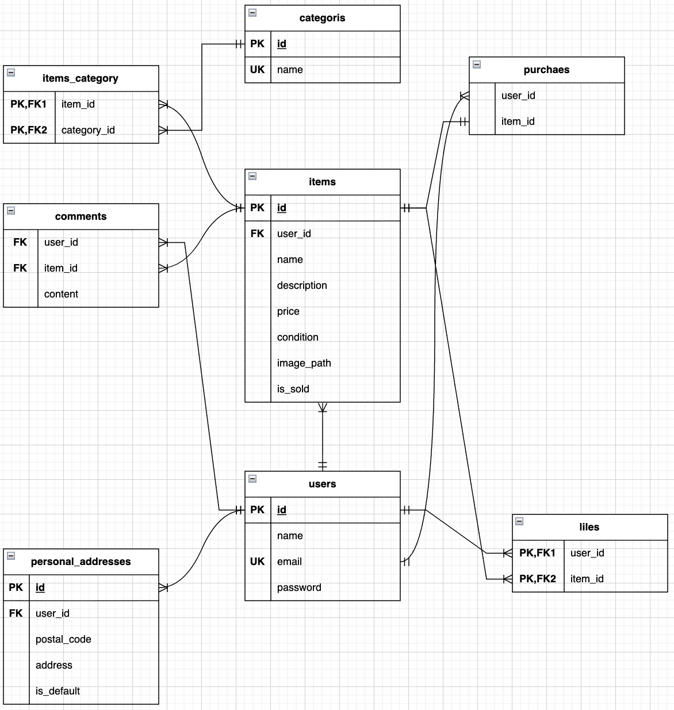

# 🛒 フリマアプリクローン開発 (free-market-app)

## 🎯 プロジェクト概要

このプロジェクトは、既存のフリマアプリの主要な機能を再現するウェブアプリケーションの開発を通じて、PHP/Laravelフレームワークを用いた実務的な開発フローを習得することを目的としています。

### 主な機能要件 (予定)

* **ユーザー認証**: 会員登録、ログイン/ログアウト機能
* **出品機能**: 商品画像のアップロード、詳細情報（価格、カテゴリなど）の登録
* **商品一覧表示**: 出品された商品のリスト表示
* **商品詳細**: 個別商品の詳細情報の表示、コメント・いいね機能
* **購入機能**: 決済機能を通じた商品購入処理
* **マイページ**: ユーザー情報、出品履歴、購入履歴の管理

## 🛠️ 使用技術 (Technology Stack)

| 区分 | 技術名 | バージョン (目安) | 備考 |
| :--- | :--- | :--- | :--- |
| **バックエンド** | PHP | 8.x 以上 | |
| **フレームワーク** | Laravel | 11.x | MVCモデルを採用 |
| **データベース** | MySQL | 8.0 以上 | 本番環境を想定 |
| **フロントエンド** | HTML / CSS | - | Bladeテンプレートを使用 |
| **バージョン管理** | Git / GitHub | - | |
| **依存性管理** | Composer | 2.x | |

## 💻 環境構築手順

以下の手順は、macOS環境でHomebrewを用いて開発環境を構築することを前提としています。

### 1. 必須ツールの確認とインストール

**Homebrew**、**PHP**、**Composer**、**MySQL** がインストールされていることを確認してください。

```bash
# Composer のインストールを確認 (バージョンが表示されればOK)
composer --version

# Homebrew で PHP と MySQL をインストール
brew install php composer mysql

## ER図


## URL
- 開発環境：http://localhost/
- phpMyAdmin:：http://localhost:8080/