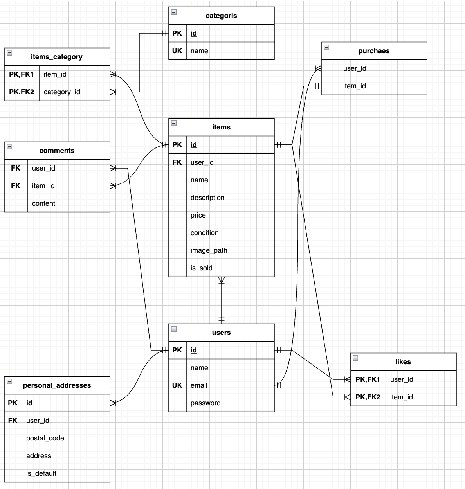

# 🛒 フリマアプリクローン開発 (free-market-app)

## 💻 環境構築手順

### 1. 必須ツールの確認とインストール

**Homebrew**、**PHP**、**Composer**、**MySQL** がインストールされていることを確認してください。


# Composer のインストールを確認 (バージョンが表示されればOK)
```bash
composer --version
```

# Homebrew で PHP と MySQL をインストール
```bash
brew install php composer mysql
```

### 2. リポジトリのクローンと移動
```bash
git clone [git@github.com:minato461/free-market-app.git]
cd free-market-app
```

### 3. 環境変数の設定
```bash
cp .env.example .env
```
# .env ファイルを開き、DB_PASSWORDに任意のパスワードを設定してください。

### 4. Dockerコンテナの起動
```bash
docker compose up -d
```

### 5. 依存パッケージのインストールとマイグレーションの実行

# Appコンテナに入る
```bash
docker compose exec app bash
```

# 依存パッケージのインストール
```bash
composer install
```

# データベーステーブルの作成 (マイグレーション)
```bash
php artisan migrate:fresh
```

## 🛠️ 使用技術 (Technology Stack)

| 区分 | 技術名 | バージョン (目安) | 備考 |
| :--- | :--- | :--- | :--- |
| **バックエンド** | PHP | 8.x 以上 | |
| **フレームワーク** | Laravel | 11.x | MVCモデルを採用 |
| **データベース** | MySQL | 8.0 以上 | 本番環境を想定 |
| **フロントエンド** | HTML / CSS | - | Bladeテンプレートを使用 |
| **バージョン管理** | Git / GitHub | - | |
| **依存性管理** | Composer | 2.x | |

## ER図


## URL
- 開発環境：http://localhost/
- phpMyAdmin:：http://localhost:8080/